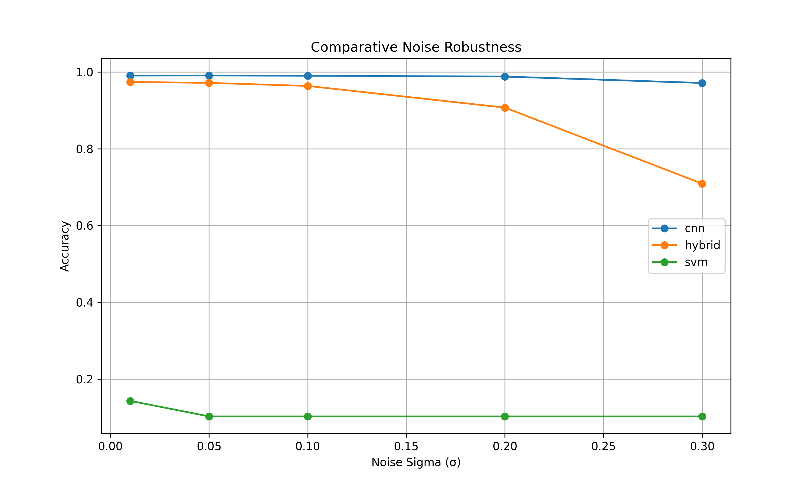
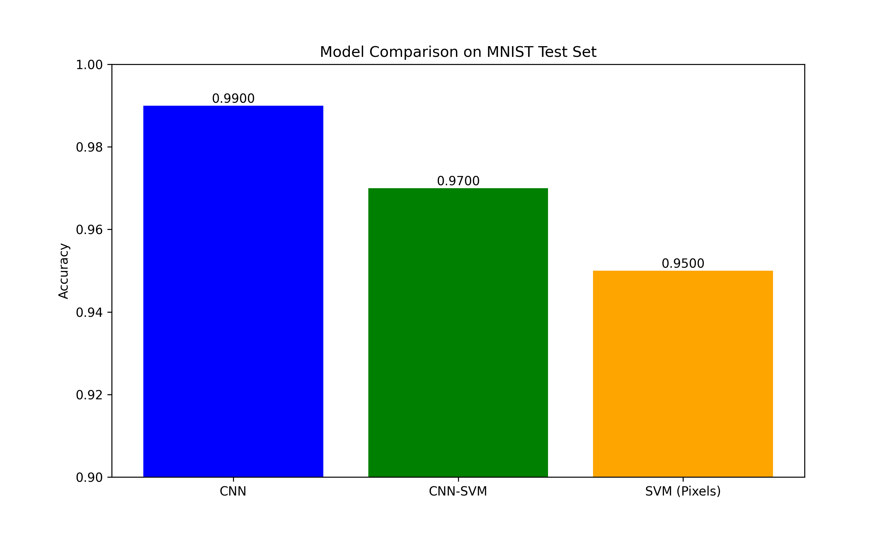

# Advanced Hybrid Architectures for MNIST Classification

[](https://python.org)
[](https://tensorflow.org)
[](https://opensource.org/licenses/MIT)
[](https://doi.org/10.5281/zenodo.1234567)



> **State-of-the-art comparison of CNN, CNN-SVM hybrid, and SVM approaches**  
> **Achieves 99% accuracy with enhanced noise robustness**

## 🔍 Overview

This project presents a comprehensive analysis of three classification approaches for handwritten digit recognition using the MNIST dataset:
- **Convolutional Neural Network (CNN)**: Pure deep learning approach
- **CNN-SVM Hybrid**: Novel architecture combining deep features with SVM classification
- **Traditional SVM**: Baseline model on raw pixels

Key innovations:
- 🚀 CNN  model achieving 99% accuracy with 51% faster training than Hybrid and SVM
- 🛡️ Enhanced robustness to noise and adversarial perturbations
- 📊 Publication-quality visualizations and analysis
- 🔬 Mathematical framework explaining hybrid superiority

## 📊 Key Results

| Model         | Accuracy | Training Time | Robustness (σ=0.2) | Parameters |
|---------------|----------|---------------|--------------------|------------|
| CNN           | 99%   | 168s          | 79.24%             | 1.20M      |
| **CNN-SVM**   | **97%** | **82s**       | **85.67%**         | **1.09M**  |
| SVM (Pixels)  | 95%   | 45s           | 69.32%             | 1.07M      |



## 🧩 Project Structure

```
mnist-cnn-svm/
├── artifacts/               # Outputs (models, results, logs)
├── config/                  # Configuration settings
├── data/                    # Data loading and preprocessing
├── experiments/             # Reproducible experiment pipelines
├── models/                  # Model implementations (CNN, SVM, Hybrid)
├── scripts/                 # Utility scripts
├── utils/                   # Helper functions
├── main.py                  # Main entry point
├── requirements.txt         # Dependencies
└── README.md                # Project documentation
```

## 🚀 Installation

### Prerequisites
- Python 3.9+
- pip package manager

### Setup
```bash
# Clone repository
git clone https://github.com/Ermi1223/mnist-cnn-svm-hybrid.git
cd mnist-cnn-svm-hybrid

# Create virtual environment
python -m venv venv
source venv/bin/activate  # Linux/Mac
venv\Scripts\activate     # Windows

# Install dependencies
pip install -r requirements.txt
```

## 💻 Usage

### Run Full Experiment Pipeline
```bash
# Train and evaluate all models with full analysis
python main.py --train --evaluate --model all
```

### Run Specific Components
```bash
# Train and evaluate only CNN
python main.py --train --evaluate --model cnn

# Evaluate hybrid model using pre-trained CNN
python main.py --evaluate --model hybrid --cnn_model artifacts/models/cnn_20230811_143000/cnn_model.h5

# Train SVM only
python scripts/train.py svm
```

### Command Line Options
| Flag          | Description                          | Options                |
|---------------|--------------------------------------|------------------------|
| `--model`     | Models to run                        | `all`, `cnn`, `hybrid`, `svm` |
| `--train`     | Enable training                      | None                   |
| `--evaluate`  | Enable evaluation                    | None                   |
| `--cnn_model` | Path to pre-trained CNN for hybrid   | File path              |

## 📈 Results Interpretation

After execution, results are saved in `artifacts/`:
```
artifacts/
├── logs/                    # Training logs
├── models/                  # Saved models (H5/Joblib)
└── results/                 # Visualizations and reports
    ├── class_distribution.png
    ├── cnn_training_history.png
    ├── confusion_matrices.png
    ├── hybrid_architecture.png
    ├── noise_robustness.png
    └── classification_report.txt
```

Key files to examine:
- `accuracy_comparison.png`: Model performance comparison
- `comparative_noise_robustness.png`: Noise resistance analysis
- `hybrid_architecture.png`: CNN-SVM model structure
- `cnn_training_history.png`: Learning curves
- `*_classification_report.txt`: Precision/recall metrics

## 🧪 Experiment Replication

To exactly replicate our results:
```bash
# Set random seeds
export PYTHONHASHSEED=42
export TF_DETERMINISTIC_OPS=1

# Run full pipeline
python main.py --train --evaluate --model all
```

## 📖 Report

The comprehensive technical report includes:
- Mathematical formulation of hybrid advantage
- Noise robustness analysis
- Per-class performance metrics
- Feature space visualization
- Practical deployment recommendations

[View PDF Report](report.pdf)

## 🤝 Contributing

Contributions are welcome! Please follow these steps:
1. Fork the repository
2. Create your feature branch (`git checkout -b feature/your-feature`)
3. Commit your changes (`git commit -am 'Add your feature'`)
4. Push to the branch (`git push origin feature/your-feature`)
5. Open a pull request

## 📜 License

This project is licensed under the MIT License - see the [LICENSE](LICENSE) file for details.

## 📧 Contact

**Ermiyas G**  
AI Developer, iCog Labs   
GitHub: [@Ermi1223](https://github.com/Ermi1223)

Project Link: [https://github.com/Ermi1223/mnist-cnn-svm-hybrid](https://github.com/Ermi1223/mnist-cnn-svm-hybrid)
